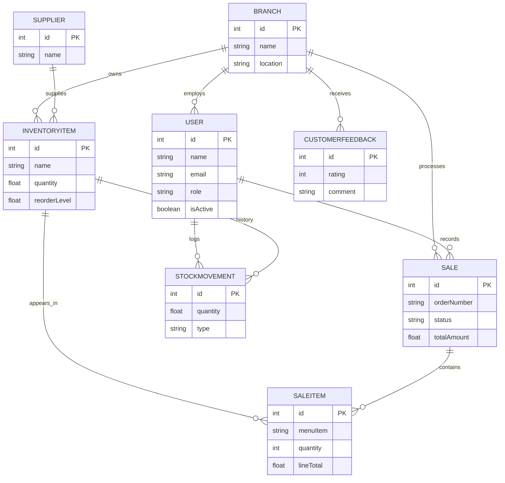

# Steakz MIS Database Documentation (ERD)

This document describes the database structure of the Steakz Management Information System (MIS) as defined in the `schema.prisma` file.

## 1. Entities and Attributes

### User
Represents all system users (Admin, Managers, Staff, Customers).
- `id` (Int, PK): Unique identifier.
- `name` (String): Full name of the user.
- `email` (String, Unique): Login email.
- `password` (String): Hashed password.
- `role` (Enum: Role): System role for RBAC.
- `isActive` (Boolean): Account status.
- `branchId` (Int, FK): The branch the user belongs to (null for Admin/HQ).
- `createdAt` / `updatedAt`: Timestamps.

### Branch
Represents a physical steakhouse location or the HQ.
- `id` (Int, PK): Unique identifier.
- `name` (String): Branch name (e.g., "Main Street").
- `location` (String): Address/City.
- `phone` (String): Contact number.
- `isActive` (Boolean): Operational status.

### InventoryItem
Items stored in a branch's inventory.
- `id` (Int, PK): Unique identifier.
- `name` (String): Item name (e.g., "Ribeye Steak").
- `category` (String): Category (e.g., "Meat", "Beverage").
- `unit` (String): Unit of measure (e.g., "kg", "pcs").
- `quantity` (Float): Current stock level.
- `reorderLevel` (Float): Threshold for low-stock alerts.
- `costPerUnit` (Float): Purchase price.
- `branchId` (Int, FK): Branch that owns this item.
- `supplierId` (Int, FK): Primary supplier for this item.

### Sale
Records of customer transactions/orders.
- `id` (Int, PK): Unique identifier.
- `orderNumber` (String, Unique): Human-readable order ID.
- `branchId` (Int, FK): Branch where the sale occurred.
- `createdById` (Int, FK): The user (Waiter/Cashier) who recorded the sale.
- `status` (Enum: SaleStatus): Order state (PENDING, PREPARING, READY, COMPLETED, CANCELLED).
- `totalAmount` (Float): Total monetary value.

### SaleItem
Line items within a sale.
- `id` (Int, PK): Unique identifier.
- `saleId` (Int, FK): The parent sale.
- `itemId` (Int, FK, Optional): Link to inventory item for stock tracking.
- `menuItem` (String): Name of the dish.
- `quantity` (Int): Number of items sold.
- `unitPrice` (Float): Price per unit at time of sale.
- `lineTotal` (Float): `quantity * unitPrice`.

### CustomerFeedback
Feedback submitted by customers.
- `id` (Int, PK): Unique identifier.
- `customerName` (String): Optional name of the customer.
- `rating` (Int): 1-5 scale.
- `comment` (String): Feedback text.
- `branchId` (Int, FK): Branch being reviewed.

### Supplier
External vendors providing inventory items.
- `id` (Int, PK): Unique identifier.
- `name` (String): Supplier name.
- `contact` / `email` / `phone`: Contact details.

### StockMovement
Log of changes to inventory levels.
- `id` (Int, PK): Unique identifier.
- `itemId` (Int, FK): The affected inventory item.
- `userId` (Int, FK): User who performed the movement.
- `type` (Enum: StockMovementType): PURCHASE, USAGE, WASTE, ADJUSTMENT.
- `quantity` (Float): Amount moved.
- `note` (String): Reason for movement.

---

## 2. Relationships and Cardinality

| Relation | Cardinality | Description |
|----------|-------------|-------------|
| **Branch to User** | 1:N | One branch can have many staff/users; a user (staff) belongs to one branch. |
| **Branch to InventoryItem** | 1:N | One branch manages many inventory items; an item belongs to one branch. |
| **Branch to Sale** | 1:N | One branch processes many sales. |
| **Branch to Feedback** | 1:N | One branch receives many customer feedbacks. |
| **User to Sale** | 1:N | A Waiter/Cashier can create many sales. |
| **Supplier to InventoryItem** | 1:N | A supplier provides many items; an item has one primary supplier. |
| **Sale to SaleItem** | 1:N | A sale consists of one or more line items. |
| **InventoryItem to SaleItem** | 1:N | An inventory item can appear in many sales (if linked). |
| **InventoryItem to StockMovement**| 1:N | An item tracks history via many movements. |
| **User to StockMovement** | 1:N | A user (Chef/Manager) can log many stock movements. |

---

## 3. Role-Based Access Control (RBAC)

The `User.role` field determines access to entities:

- **ADMIN**: Full access to all Branches, Users, Inventory, and Reports.
- **HEADQUARTER_MANAGER**: Read-only/Management access to all Branches; full access to global Reports and Feedback.
- **BRANCH_MANAGER**: Full access to their own Branch, its Staff, Inventory, Sales, and Reports.
- **CHEF**: Access to Inventory (Manual updates) and Sales (Status updates to READY) within their Branch.
- **WAITER / CASHIER**: Access to create Sales and update Status (COMPLETED) within their Branch.
- **CUSTOMER**: Can only create `CustomerFeedback` (Public).

---

## 4. Mermaid ER Diagram

