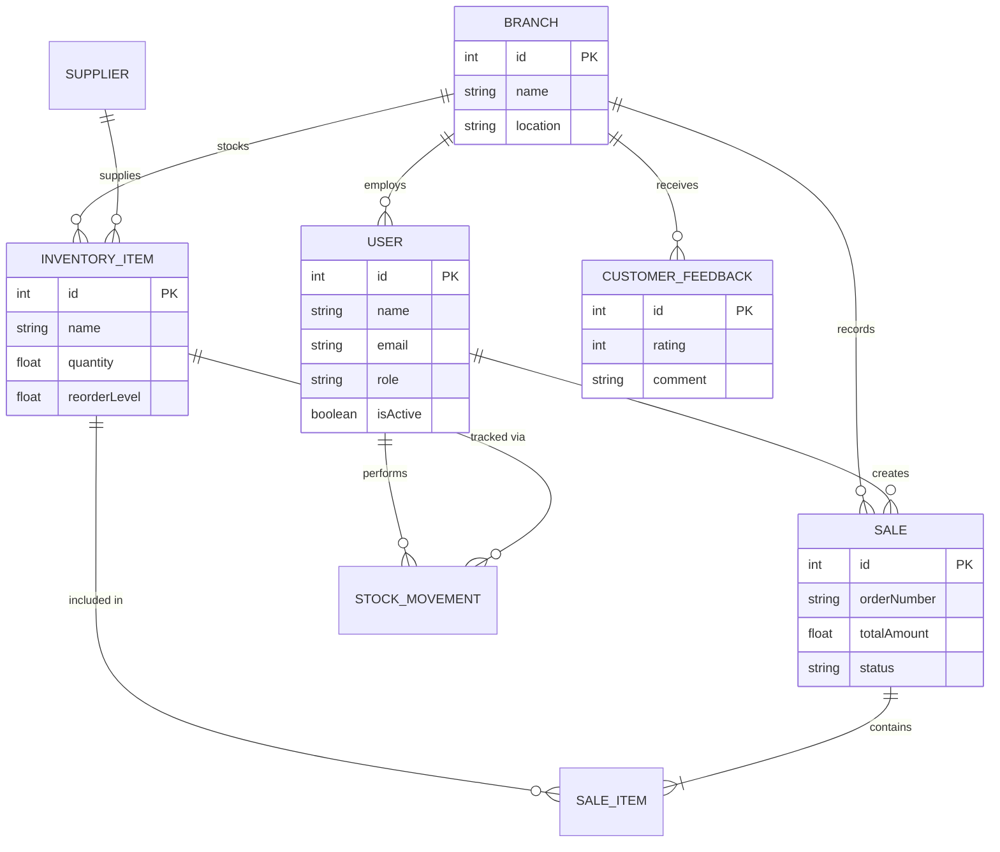

# ERD Documentation Guide - Steakz MIS

This guide provides a detailed breakdown of the Database Schema for the Steakz Management Information System (MIS), based on the implemented Prisma model.

---

## 1. Entity List & Attributes

| Entity | Attributes | Primary Key | Foreign Keys |
|--------|------------|-------------|--------------|
| **User** | id, name, email, password, role, isActive, branchId, createdAt, updatedAt | id | branchId (Branch) |
| **Branch** | id, name, location, phone, isActive, createdAt, updatedAt | id | - |
| **Supplier** | id, name, contact, email, phone, createdAt, updatedAt | id | - |
| **InventoryItem** | id, name, category, unit, quantity, reorderLevel, costPerUnit, branchId, supplierId, createdAt, updatedAt | id | branchId (Branch), supplierId (Supplier) |
| **StockMovement** | id, itemId, userId, type, quantity, note, createdAt | id | itemId (InventoryItem), userId (User) |
| **Sale** | id, orderNumber, branchId, createdById, status, totalAmount, createdAt, updatedAt | id | branchId (Branch), createdById (User) |
| **SaleItem** | id, saleId, itemId, menuItem, quantity, unitPrice, lineTotal | id | saleId (Sale), itemId (InventoryItem) |
| **CustomerFeedback** | id, customerName, rating, comment, branchId, createdAt | id | branchId (Branch) |

---

## 2. Relationships & Cardinality

- **Branch to User (1:N)**: A branch employs many users; a user belongs to one branch (optional for HQ staff).
- **Branch to InventoryItem (1:N)**: A branch stocks many inventory items; an item belongs to one branch.
- **Branch to Sale (1:N)**: A branch records many sales; a sale is linked to one branch.
- **Branch to CustomerFeedback (1:N)**: A branch receives many feedbacks; feedback is linked to one branch.
- **User to Sale (1:N)**: A user (Staff or Customer) creates many sales; a sale is created by one user.
- **User to StockMovement (1:N)**: A staff member performs many stock movements; a movement is recorded by one user.
- **InventoryItem to StockMovement (1:N)**: An item has many movement records; a movement refers to one item.
- **Supplier to InventoryItem (1:N)**: A supplier provides many inventory items; an item can have one supplier.
- **Sale to SaleItem (1:N)**: A sale contains many items; a sale item belongs to one sale.
- **InventoryItem to SaleItem (1:N)**: An inventory item can be referenced in many sale items (optional link).

---

## 3. Mermaid ER Diagram

---

## 4. Draw.io Layout Guide

To create a clean visual ERD in Draw.io, follow this layout strategy:

1.  **Top Row (Core/Entities)**:
    *   Place **Branch** in the center.
    *   Place **Supplier** to the far left.
2.  **Middle Row (Main Operations)**:
    *   Place **User** to the left of Branch.
    *   Place **InventoryItem** directly below Branch/Supplier.
    *   Place **Sale** to the right of Branch.
3.  **Bottom Row (Details/Logs)**:
    *   Place **StockMovement** below InventoryItem and User.
    *   Place **SaleItem** directly below Sale.
    *   Place **CustomerFeedback** below Branch.
4.  **Connectors**:
    *   Use Crow's Foot notation.
    *   Ensure all foreign keys (e.g., `branchId`) have a clear line connecting back to the Primary Key (e.g., `Branch.id`).
