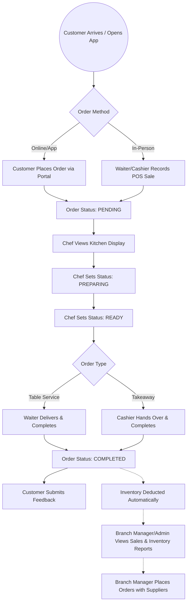
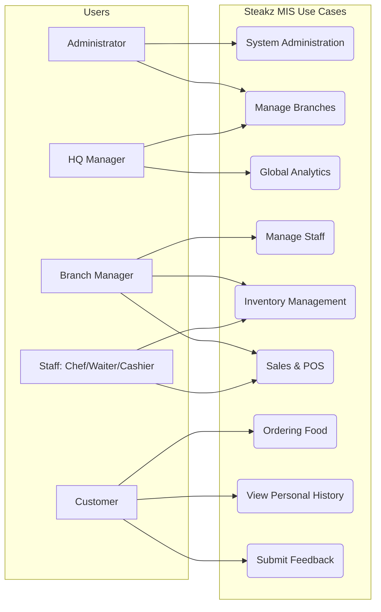
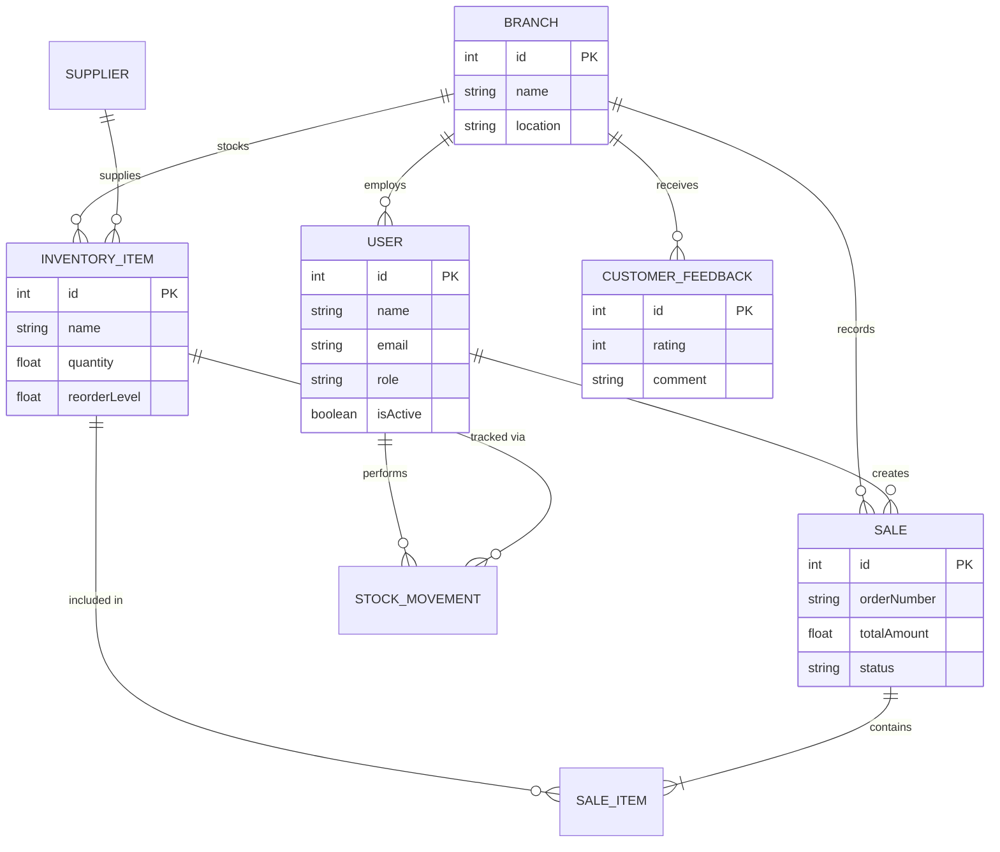

# Lab Day Submission: Steakz Management Information System (MIS)

This document provides a comprehensive overview of the Steakz MIS project, including business processes, technical architecture, and deployment information.

---

## 1. Business Process Diagram
The following flowchart represents the core operational flow of the Steakz restaurant, from customer ordering to final fulfillment and management oversight.

---

## 2. API Endpoints and Access Control

| Method | URL | Purpose | Access Control (Roles) |
|--------|-----|---------|------------------------|
| **POST** | `/api/auth/login` | Authenticate user and get JWT token | Public |
| **GET** | `/api/auth/me` | Get current logged-in user profile | All Authenticated Users |
| **POST** | `/api/admin/branches` | Create a new branch and its manager | ADMIN |
| **GET** | `/api/admin/branches` | List all branches and high-level stats | ADMIN, HEADQUARTER_MANAGER |
| **GET** | `/api/admin/overview` | System-wide KPI overview | ADMIN, HEADQUARTER_MANAGER |
| **GET** | `/api/manager/dashboard` | Branch-specific dashboard stats | BRANCH_MANAGER |
| **POST** | `/api/manager/staff` | Create new staff (Chef, Waiter, Cashier) | BRANCH_MANAGER |
| **GET** | `/api/branches` | Public listing of branches for landing page | Public |
| **GET** | `/api/inventory` | View inventory items | ADMIN, HEADQUARTER_MANAGER, BRANCH_MANAGER, CHEF, CASHIER, WAITER |
| **PATCH** | `/api/inventory/:id/quantity`| Update stock levels | ADMIN, BRANCH_MANAGER, CHEF |
| **POST** | `/api/sales` | Create a new sale/order | CASHIER, WAITER, BRANCH_MANAGER, CUSTOMER |
| **GET** | `/api/sales/mine` | View order history filtered by role | ALL ROLES |
| **PATCH**| `/api/sales/:id/status`| Update order status (PREPARING, READY, etc.)| CHEF, BRANCH_MANAGER, ADMIN, CASHIER, WAITER, HEADQUARTER_MANAGER |
| **GET** | `/api/reports/summary`| Financial and inventory summary | ADMIN, HQ, BRANCH_MANAGER |
| **POST** | `/api/feedback` | Submit customer feedback (branchId, rating, comment required) | CUSTOMER / Public visitor |
| **GET** | `/api/feedback/public`| Latest public feedbacks | Public |

The API endpoints were verified using a Postman collection containing 30 requests and 65 assertions, all passing successfully.

---

## 3. Use-Case Diagram
The diagram below illustrates the interactions between different user roles and the system's core functionalities.

---

## 4. Entity-Relationship (ER) Diagram
This diagram represents the data structure defined in the Prisma schema, illustrating the relationships between users, branches, sales, and inventory.

---

## 5. Deployment and Source Code

| Resource | Link |
|----------|------|
| **Deployed Application** | [https://steakz-mis-task2.vercel.app](https://steakz-mis-task2.vercel.app) |
| **Backend Deployment** | [https://steakz-mis-backend-v0hz.onrender.com](https://steakz-mis-backend-v0hz.onrender.com) |
| **Backend GitHub** | [Source Code](https://github.com/Ahmed-Amro-Ahmed/steakz-mis-task2/tree/main/Steakz_Backend_ONLY/steakz-backend) |
| **Frontend GitHub** | [Source Code](https://github.com/Ahmed-Amro-Ahmed/steakz-mis-task2/tree/main/Steakz_Frontend_ONLY/steakz-frontend) |

---

## 6. Submission Credentials

For evaluation and testing purposes, please use the following administrative credentials to access the full capabilities of the MIS:

*   **Role**: System Administrator (Full Access)
*   **Email**: `admin@steakz.com`
*   **Password**: `Admin@123`

---
**Author**: Ahmed Amro Ahmed
**Submission Date**: Wednesday, 10 June 2026
**Project**: Steakz MIS - Task 2 Final Submission
