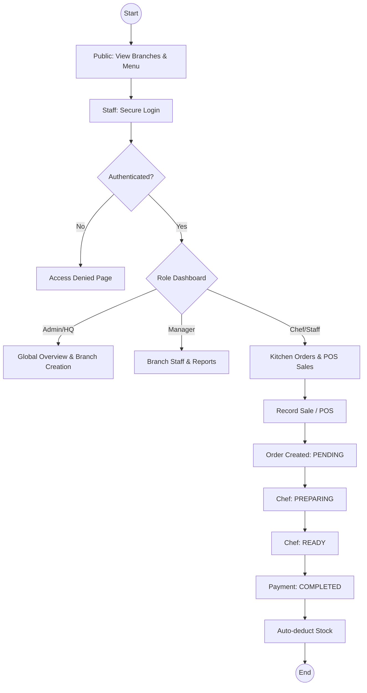
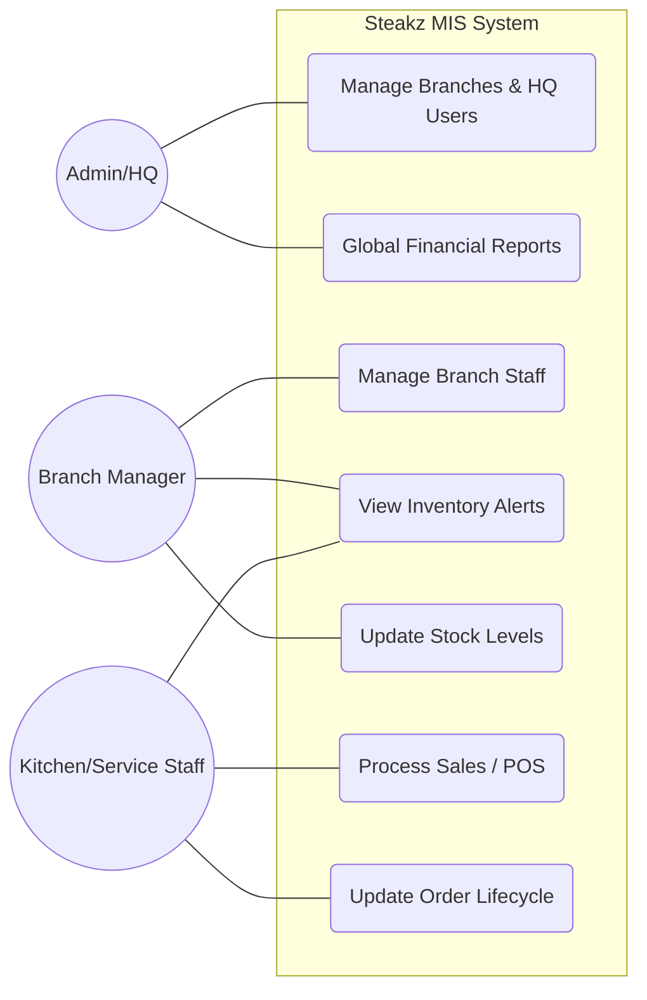
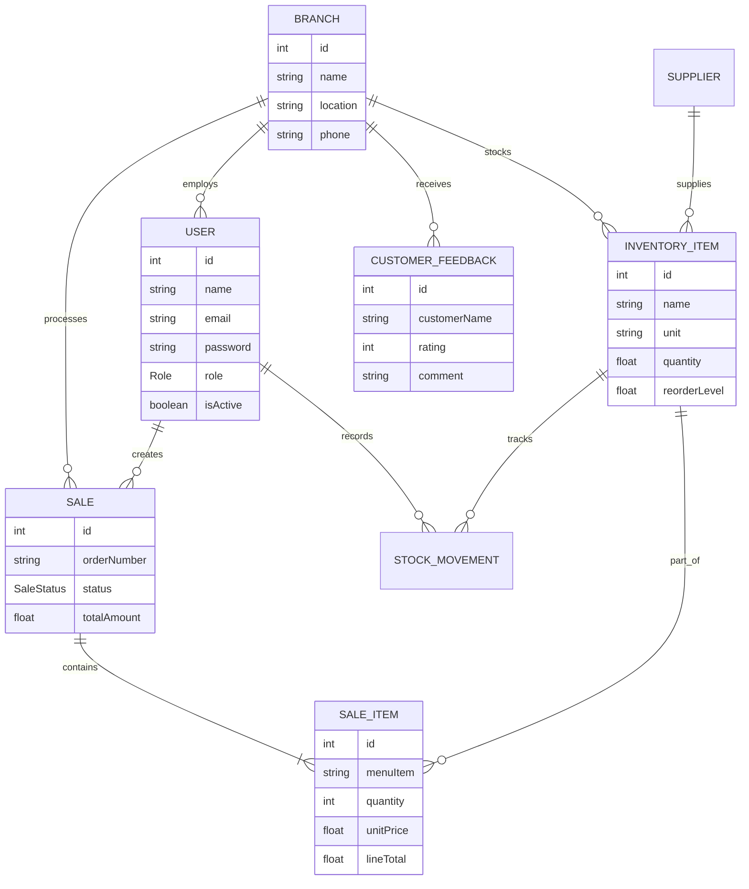

# Steakz MIS Task 2 - Lab Demo Document

## 1. Business Process Diagram

## 2. Use-Case Diagram

## 3. ER Diagram (Prisma Schema)

## 4. API Endpoint Table
| Endpoint URL | Method | Purpose | Access Role |
|:---|:---|:---|:---|
| `/api/auth/login` | POST | Authenticate user and get JWT | PUBLIC |
| `/api/auth/me` | GET | Get current logged-in user profile | ALL |
| `/api/admin/branches` | POST | Create a new branch and its manager | ADMIN |
| `/api/admin/branches` | GET | List all branches and stats | ADMIN, HQ_MANAGER |
| `/api/admin/users` | GET | List all system users | ADMIN, HQ_MANAGER |
| `/api/admin/overview` | GET | System-wide KPI overview | ADMIN, HQ_MANAGER |
| `/api/manager/dashboard` | GET | Branch-specific dashboard stats | BRANCH_MANAGER |
| `/api/manager/staff` | POST | Create new staff (Chef/Waiter/Cashier) | BRANCH_MANAGER |
| `/api/manager/staff` | GET | List staff in current branch | BRANCH_MANAGER |
| `/api/inventory` | GET | View inventory items | ALL STAFF |
| `/api/inventory/:id/quantity`| PATCH | Manually update stock levels | CHEF, MANAGER, ADMIN |
| `/api/sales` | POST | Record a new customer sale (POS) | CASHIER, WAITER |
| `/api/sales/:id/status` | PATCH | Update order status (Pending -> Completed) | CHEF, MANAGER |
| `/api/reports/summary` | GET | Financial/Inventory summary report | MANAGER, HQ, ADMIN |
| `/api/feedback` | POST | Submit customer feedback | PUBLIC |

## 5. Deployment & Source Control
*   **Backend GitHub:** [PLACEHOLDER]
*   **Frontend GitHub:** [PLACEHOLDER]
*   **Live Application:** [PLACEHOLDER]

## 6. Admin Credentials
*   **Email:** `admin@steakz.com`
*   **Password:** `Admin@123`

## 7. Lab Demo Checklist
- [ ] **Landing Page:** Show public branch list and menu.
- [ ] **Authentication:** Login as Admin, HQ, Manager, and Chef.
- [ ] **Admin Dashboard:** Show multi-branch oversight.
- [ ] **POS Workflow:** Create a sale as a Waiter and show inventory deduction.
- [ ] **Kitchen Pipeline:** Advance an order through preparation stages as a Chef.
- [ ] **RBAC:** Attempt to access Admin panel as a Chef to show "Access Denied".
- [ ] **Feedback:** Submit a public review and view it as a Manager.
